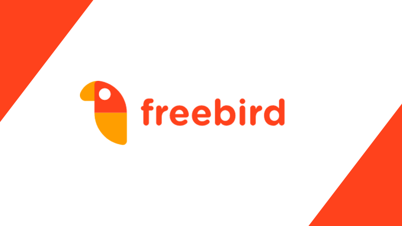

# Freebird

<!---Esses são exemplos. Veja https://shields.io para outras pessoas ou para personalizar este conjunto de escudos. Você pode querer incluir dependências, status do projeto e informações de licença aqui--->




>Ferramenta Open Source para fomentar empresas, ecossistemas, organizações e associações da Indústria Criativa. Cada usuário tem liberdade para executar, acessar, modificar e desenvolver o código fonte para ser implementado em ecossistemas criativos.

## Implementações

O Freebird vem em três formas:
* A versão em [MVC](https://towardsdatascience.com/everything-you-need-to-know-about-mvc-architecture-3c827930b4c1) desse repositório
* A versão orientada à microsserviços, separada em API/Cliente - Programada para o dia 31/01
* A linguagem do Back-end é c# .NetCore 5.0
* O front end do MVC está em [Blazor](https://dotnet.microsoft.com/en-us/apps/aspnet/web-apps/blazor)
* O front end do cliente está em React.

### Ajustes e melhorias

Roadmap:

- [x] Arquitetura MVC em Blazor
- [x] Back end .NetCore
- [x] Modificação para MicroServiços
- [ ] Habilitação da API em .NetCore
- [ ] Habilitação de plugins de Front-End em React

## 💻 Pré-requisitos
<!---Estes são apenas requisitos de exemplo. Adicionar, duplicar ou remover conforme necessário--->
* .Net 5.0
* PostGreS para funcionalidade out-of-the box, porém qualquer banco pode ser implementado de acordo com o [guia](https://docs.microsoft.com/en-us/ef/core/providers/?tabs=dotnet-core-cli).
* [Documentação](https://freebirdcore.herokuapp.com/documentation/index.html).
* [Docker](https://docs.docker.com/get-docker/)

## 🚀 Instalando o Freebird

Para instalar o Freebird, siga estas etapas:

### Maps API
* Primeiro obtenha uma chave da API grátis do [Google Maps](https://developers.google.com/maps/documentation)
* Vá até Views/Servicos/Details.cshtml e procure a linha 206.
* Modifique a chave {YOUR_API_KEY_HERE} para utilizar a chave obtida pelo google

### PostGres
* Use o serviço de database de sua preferência, recomendamos o Tier grátis do [Heroku](https://devcenter.heroku.com/articles/heroku-postgresql)
* Vá até o arquivo appsettings.json e encontre as chaves `{HOST}` `{DATABASE}` `{PORT}` `{USERNAME}` `{PASSWORD}` e modifique para utilizar os valores fornecidos pelo serviço utilizado
* Ou caso seja disponível troque pela string de conexão fornecida pelo banco de dados.
* Utilize o comando Update-Databases no Package Console do Visual Studio.

### O projeto é baseado em docker para facilitar a implantação.

* Para disponibilizar o app online recomendamos a utilização do Tier grátis do [Heroku](https://medium.com/@lorranpalmeira/deploy-de-uma-aplica%C3%A7%C3%A3o-net-core-3-0-docker-no-heroku-481c21f8d3c5) o projeto já está configurado para a utilização no Heroku, portanto só os passos de configuração da conta e do CLI são necessários.
* Abra o arquivo Deploy.ps1 no seu editor de texto de preferência.
* Troque o nome nas chaves `{APP-NAME}` para o nome definido no passo anterior.
* Abra o Powershell ou CMD no windows e execute o arquivo Deploy.ps1

### Construir a imagem do Docker manualmente:
```
docker build -t <nome> .
docker run <nome>
```
### Visual Studio

Caso esteja usando o Visual Studio para edição do código o freebird é configurado para utilizar o botão run do docker no Visual Studio;

## ☕ Usando o Freebird

Para usar Freebird, siga estas etapas:

* Após executar a imagem do Docker, entre no endereço mostrado.
* Para Editar os templates de acordo com sua vontade entre na pasta `Views`.
* A pasta `Models` contém os modelos para utilização da Database.
* A pasta `Controllers` faz a conexão entre a Database e as respectivas páginas.

## 📫 Contribuindo para o Freebird
<!---Se o seu README for longo ou se você tiver algum processo ou etapas específicas que deseja que os contribuidores sigam, considere a criação de um arquivo CONTRIBUTING.md separado--->
Para contribuir com o Freebird, entre no Discord e siga estas etapas:

1. Bifurque este repositório.
2. Crie um branch: `git checkout -b <nome_branch>`.
3. Faça suas alterações e confirme-as: `git commit -m '<mensagem_commit>'`
4. Envie para o branch original: `git push origin <nome_do_projeto> / <local>`
5. Crie a solicitação de pull.

Como alternativa, consulte a documentação do GitHub em [como criar uma solicitação pull](https://help.github.com/en/github/collaborating-with-issues-and-pull-requests/creating-a-pull-request).

## 🤝 Colaboradores

Agradecemos às seguintes pessoas que contribuíram para este projeto:

<table>
  <tr>
    <td align="center">
      <a href="https://github.com/c0nundrum">
        <br>
        <sub>
          <b>Danilo Ribeiro</b>
        </sub>
      </a>
    </td>
    <td align="center">
      <a href="https://github.com/enirya">
        <br>
        <sub>
          <b>Tayrine Lopes</b>
        </sub>
      </a>
    </td>
    <td align="center">
      <a href="https://github.com/fabricciocanhete">
        <br>
        <sub>
          <b>Fabriccio Canhete</b>
        </sub>
      </a>
    </td>
    <td align="center">
      <a href="https://github.com/guscooke">
        <br>
        <sub>
          <b>Gustavo Cooke</b>
        </sub>
      </a>
    </td>
    <td align="center">
      <a href="https://github.com/rhanielvalle">
        <br>
        <sub>
          <b>Rhaniel Valle</b>
        </sub>
      </a>
    </td>
  </tr>
</table>

## Agradecimentos


## 📝 Licença

Esse projeto está sob licença. Veja o arquivo [LICENÇA](LICENSE.md) para mais detalhes.

[⬆ Voltar ao topo](#freebird)<br>
